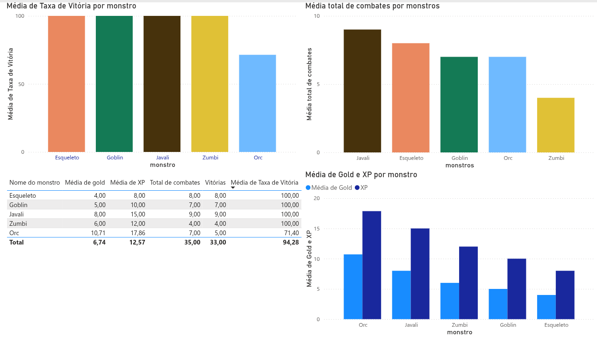
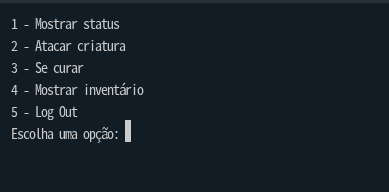
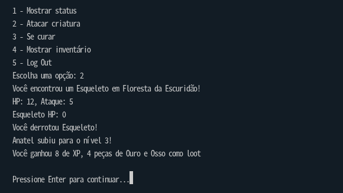
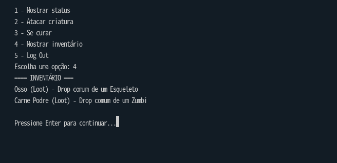

# Selune

RPG de texto em Python, com sistema de combate, evolução de personagem e persistência de dados em PostgreSQL.

Projeto desenvolvido como estudo prático de Programação Orientada a Objetos, modelagem de banco de dados relacional e integração Python + PostgreSQL, evoluindo depois para práticas de Engenharia de Dados.

## Tecnologias

- **Python 3** — lógica do jogo (POO: herança, composição, polimorfismo)
- **PostgreSQL** — persistência de dados (players, monstros, itens, localizações, inventário)
- **psycopg2** — driver de conexão Python ↔ PostgreSQL
- **python-dotenv** — gerenciamento seguro de credenciais via variáveis de ambiente
- **Docker** — containerização da aplicação e do banco
- **Apache Spark (PySpark)** — processamento e análise de logs de combate
- **dbt** — transformação de dados direto no PostgreSQL (staging + marts)
- **Power BI** — dashboard de estatísticas de combate

## Estrutura do projeto

```
Selune/
├── main.py                  # ponto de entrada do jogo (menu, loop principal)
├── postgre.sql              # script de criação das tabelas do banco
├── requirements.txt         # dependências Python
├── .env.example              # modelo de variáveis de ambiente (sem valores reais)
│
├── Entities/                # classes de domínio do jogo
│   ├── player.py             # Player (composição: Inventory, Equipment)
│   ├── monster.py            # Monstro
│   ├── item.py                # Item + subclasses (Weapon, Armadura, Consumivel, Loot, Acessorio)
│   ├── inventory.py          # Inventory (lista de itens do player)
│   └── equipment.py          # Equipment (slots de arma/armadura/acessório)
│
├── Systems/
│   └── combat.py             # Combat — orquestra turnos, XP, gold, loot e logs
│
├── World/
│   └── location.py           # Localização (regiões do jogo)
│
├── Database/                 # camada de acesso a dados (Repository Pattern)
│   ├── connection.py             # conexão com PostgreSQL via .env
│   ├── player_repository.py      # CRUD de players
│   ├── monster_repository.py     # CRUD de monstros + relação com localizações
│   ├── item_repository.py        # CRUD de itens
│   ├── location_repository.py    # CRUD de localizações
│   ├── inventory_repository.py   # inventário persistido (upsert de quantidade)
│   ├── combat_log_repository.py  # registro de logs de combate
│   └── seed.py                    # popula o banco com dados iniciais
│
└── analytics/                # camada de engenharia de dados
    ├── spark/                    # exportação e análise com PySpark
    │   ├── export_csv.py
    │   └── combat_analysis.py
    └── selune_dbt/                # transformações via dbt
        └── models/
            ├── staging/            # views limpas sobre as tabelas brutas
            └── marts/              # estatísticas agregadas (ex: monster_stats)
```

## Modelo de dados

- **players** — dados do personagem (status, atributos, progressão)
- **items** — itens do jogo, com herança em tabela única (armas, armaduras, consumíveis, loot, acessórios)
- **monsters** — monstros, cada um com um possível item de loot (`loot_item_id`, opcional)
- **locations** — regiões do mundo
- **monster_locations** — relação muitos-para-muitos entre monstros e regiões
- **inventory** — relação muitos-para-muitos entre players e items, com quantidade
- **combat_logs** — histórico de cada combate (player, monstro, xp, gold, vitória, duração)

## Como executar

### Pré-requisitos

- Python 3.10+
- PostgreSQL instalado e rodando

### 1. Clone o repositório

```bash
git clone https://github.com/willian-andrade-dev/Selune.git
cd Selune
```

### 2. Crie um ambiente virtual e instale as dependências

```bash
python -m venv .venv
source .venv/bin/activate   # Linux/Mac
pip install -r requirements.txt
```

### 3. Configure as variáveis de ambiente

Copie o modelo e preencha com suas credenciais reais do PostgreSQL:

```bash
cp .env.example .env
```

Edite o `.env` com seu editor de preferência:

```
DB_HOST=localhost
DB_PORT=5432
DB_NAME=rpg_database
DB_USER=postgres
DB_PASSWORD=sua_senha_aqui
```

### 4. Crie o banco de dados

```sql
CREATE DATABASE rpg_database;
```

### 5. Crie as tabelas

Rode o script `postgre.sql` no banco `rpg_database` (via extensão do VSCode, DBeaver, ou terminal `psql`).

### 6. Popule os dados iniciais (itens, monstros, localizações)

```bash
python -m Database.seed
```

### 7. Rode o jogo

```bash
python main.py
```

## Como executar (com Docker)

Alternativa mais rápida ao setup manual — sobe o jogo e o PostgreSQL juntos, sem precisar instalar Postgres localmente.

### Pré-requisitos
- Docker e Docker Compose instalados

### 1. Clone o repositório

```bash
git clone https://github.com/willian-andrade-dev/Selune.git
cd Selune
```

### 2. Configure as variáveis de ambiente

```bash
cp .env.example .env
```

Edite o `.env` e defina ao menos a `DB_PASSWORD` (as outras variáveis já têm valores compatíveis com o Docker Compose).

### 3. Suba os containers

```bash
docker compose up --build
```

Isso cria o banco PostgreSQL, executa `postgre.sql` automaticamente (criando as tabelas) e inicia o jogo.

### 4. Popule os dados iniciais (em outro terminal, com os containers rodando)

```bash
docker compose exec app python -m Database.seed
```

> **Nota:** se estiver usando a extensão Docker do VSCode e o painel de logs não aceitar input do teclado, use:
> ```bash
> docker compose up --build -d
> docker attach selune_app
> ```

## Funcionalidades

- Criação e login de personagem (progresso salvo no banco)
- Sistema de combate por turnos
- Ganho de XP, ouro e itens ao derrotar monstros
- Sistema de level up (aumenta ataque e HP máximo)
- Inventário persistente
- Sistema de equipamento (arma, armadura, acessório)
- Uso de itens (cura, equipar) com efeitos distintos por tipo (polimorfismo)
- Monstros distribuídos por região (relação muitos-para-muitos)
- Registro de logs de combate para análise de dados

## Analytics (Engenharia de Dados)

Cada combate gera um registro em `combat_logs` (player, monstro, XP, gold, vitória/derrota, duração). A partir desses dados brutos:

```
combat_logs (PostgreSQL)
      │
      ├── Spark  → analytics/spark/  → exporta e processa os logs, gera estatísticas em CSV
      │
      └── dbt    → analytics/selune_dbt/models/
                      ├── staging/  → view limpa sobre a tabela bruta (stg_combat_logs)
                      └── marts/    → estatísticas agregadas por monstro (monster_stats)
                            │
                            └── exportado para CSV → Power BI (dashboard)
```

**Spark e dbt foram implementados em paralelo como exercício de aprendizado** — na prática, ambos resolvem o mesmo problema (transformar `combat_logs` em estatísticas agregadas). Em produção, a escolha entre um ou outro dependeria do volume de dados e de onde eles residem: dbt se destaca quando os dados já estão num data warehouse e a transformação pode ser feita via SQL; Spark se destaca com volumes que excedem a capacidade de processamento de um único banco, ou dados vindos de múltiplas fontes fora de um banco relacional.

> Em produção, com alto volume de usuários, `combat_logs` seria replicado para um Data Warehouse separado antes de qualquer transformação, evitando sobrecarga no banco operacional que sustenta o jogo em tempo real.

### Dashboard (Power BI)



### Rodando a camada de Analytics

```bash
# Carrega as variáveis de ambiente na sessão do terminal
set -a; source .env; set +a

# Spark
python -m analytics.spark.export_csv
python -m analytics.spark.jobs.combat_analysis

# dbt (a partir de analytics/selune_dbt/)
cd analytics/selune_dbt
dbt run
dbt test
```

## Prints

### Menu Principal


### Combate


### Inventário


## Roadmap

Projeto em desenvolvimento contínuo. Próximos passos incluem:
- Orquestração da camada de analytics via Airflow
- Containerização do Spark e dbt (hoje rodam localmente, fora do Docker Compose)
- Sistema de loja, NPCs e crafting